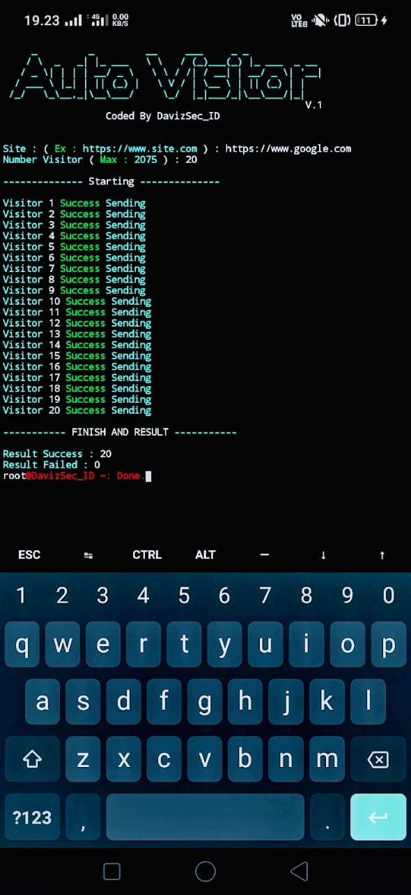
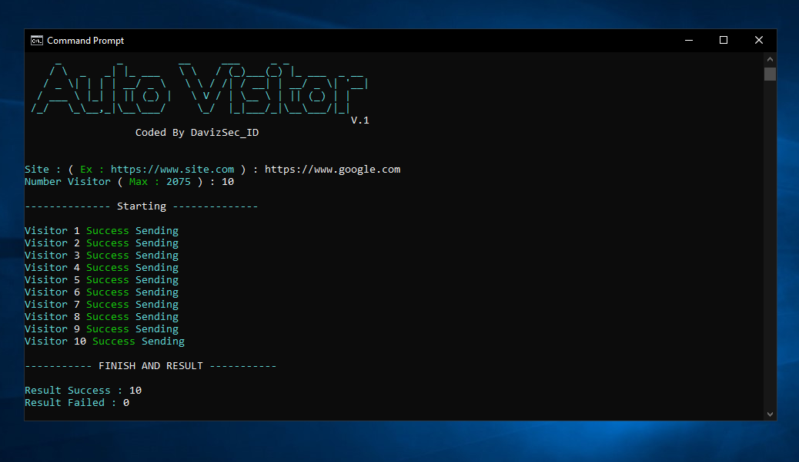

# Auto Visitor
 Coded By Daviz Official
 
## Clone [ For Android ]
```
$ pkg install git
```
```
$ pkg install python2
```
```
$ pip install requests
```
```
$ pip2 install requests
```
```
$ git clone https://github.com/davizofficial/Auto-visitor
```
## Uses
```
$ python2 auto-visit.py
```

## Contact
*[Social Media](https://linktr.ee/davizarva)*

# Operating system
<b> [+] Linux
# Screenshots


<h1> License </h1>


<br>Copyright 2020 (c) Public License
